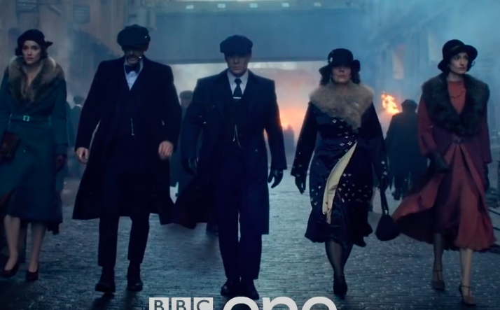
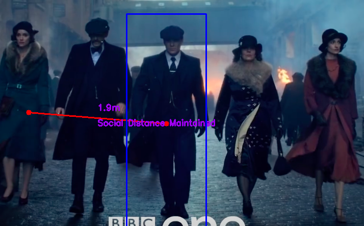

# Social Distancing Using Deep Learning and OpenCV

## Objective
   Today's unfortunate circumstances due to COVID-19, keeping distance among people is crucial. 
   The goal is to detect people using Deep Learning and find the distance between people to check
   whether a norm social distance of 6feet or 1.8m is maintained by people.
   

   
## Tool and Libraries

* Python
* OpenCV
* YoloV3

## Description

* Step 1: Find the number of people in the frame/Image.
* Step 2: Creating Bounding Box over the people identified using YOLO.
* Step 3: A width threshold is set for object among which the distance is measured i.e. the width of the people. I am setting width as 27inch or 0.70 meter. Try other values if required.
* Step 4: Mapping the pixels to metric (meter or inches).
* Step 5: Find the distance between, the center point of one person to another person in meters.

## Result

